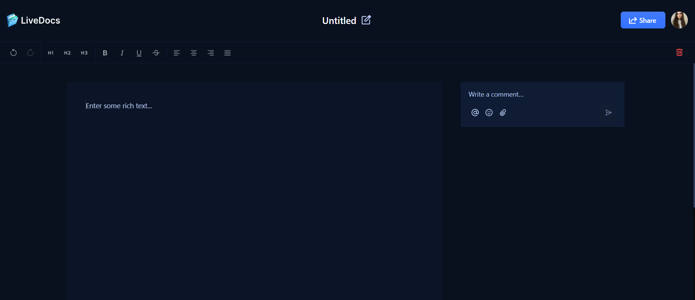

#  

# LiveDocs

LiveDocs is a collaborative real-time document editing platform built with cutting-edge web technologies.  
Work together, share ideas instantly, and manage access all in one place!

---

## ✨ Features

- 🔐 **Authentication & Authorization** — powered by [Clerk](https://clerk.com)
- 📝 **Collaborative editor** — Liveblocks + Lexical
- 👥 **Real-time presence & cursors** — see who's online and editing
- 📂 **Document management** — create, rename, delete, and share docs
- 📢 **Notifications** — instant alerts about access changes
- 👀 **Role-based access** — editors & viewers with permissions
- 🎨 **Modern UI/UX** — built with [TailwindCSS](https://tailwindcss.com) and ShadCN UI
- ☁️ **Deployed on Vercel** — fast, scalable, and production-ready

---

## 🛠 Tech Stack

- **Framework:** [Next.js 14](https://nextjs.org) (App Router)
- **Auth:** [Clerk](https://clerk.com)
- **Collaboration:** [Liveblocks](https://liveblocks.io)
- **UI:** ShadCN UI, [TailwindCSS](https://tailwindcss.com)
- **Editor:** Lexical via Liveblocks
- **Icons:** Lucide React
- **State/UI:** Radix UI, Sonner
- **Error Tracking:** Sentry

---

## 🚀 Getting Started

**Install dependencies:**

npm install

**Run the development server:**

**Open [http://localhost:3000](http://localhost:3000) in your browser to view the app.**

You can start editing the page by modifying:

- `app/page.tsx` (the home page)  
- `app/documents/[id]/page.tsx` (the collaborative document page)

---

This setup allows you to quickly start developing and testing LiveDocs on your local machine.

## 📖 Usage

- Sign up / log in with Clerk
- Create new documents
- Edit in real time — instant updates for all collaborators
- Share docs via email invitation
- Manage roles: Editor or Viewer
- Track notifications for access changes

---

## ⚡ Benefits

- Eliminates need for Google Docs or Notion in small teams
- Privacy-friendly: data stays within your infra
- Great for remote teams, startups, and students
- Easy to scale with Next.js + Liveblocks infra

---

## 🧩 Challenges Faced

- Synchronizing Clerk & Liveblocks users (email ↔ role mapping)
- Real-time presence management at scale
- Strict role permissions (creator can't be removed, role logic)
- Handling Clerk avatar images via external Next.js domains
- UI consistency: ShadCN UI × Tailwind x accessibility

---

## 📚 Learn More

- [Next.js Documentation](https://nextjs.org/docs)
- [Clerk Documentation](https://clerk.com/docs)
- [Liveblocks Documentation](https://liveblocks.io/docs)
- [ShadCN UI](https://ui.shadcn.com)

---

## 📦 Deployment

The easiest way to deploy is via [Vercel](https://vercel.com).

See official [Next.js deployment docs](https://nextjs.org/docs/app/building-your-application/deploying) for details.

---

> Built with ❤️ by Halyna Marchenko
